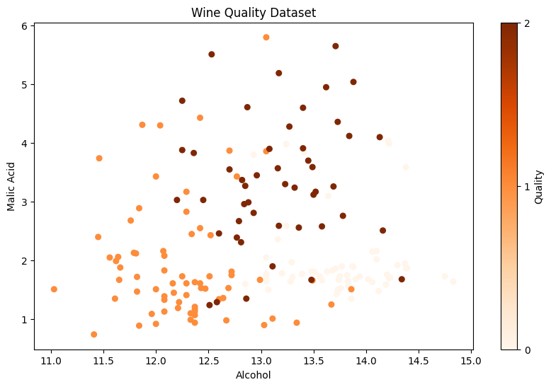
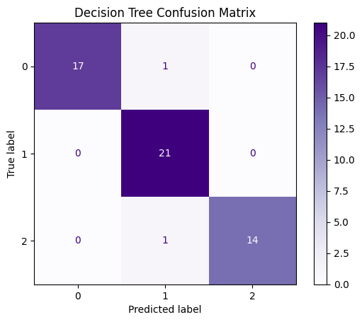
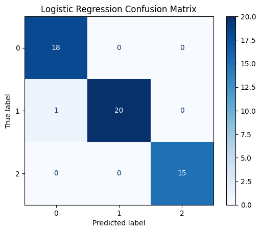

# Nano706 Homework – Exercises 1 & 2

This repository contains my collab notebooks for Exercise 1 (Wine Quality Dataset) and Exercise 2 (YOLOv5 Object Detection).  
Each notebook demonstrates a core machine-learning workflow, one for data classification and one for real-time image detection.

---

Exercise 1 – Wine Quality Dataset

In this notebook, we:
1. Load and explore the scikit-learn Wine dataset (`sklearn.datasets.load_wine()`).
2. Visualize alcohol vs malic acid scatterplots by wine class.
3. Standardize features using `StandardScaler()`.
4. Split into training and testing sets (`train_test_split`).
5. Train three models:
   - Support Vector Machine (SVM)
   - Decision Tree Classifier
   - Logistic Regression
6. Evaluate model performance using accuracy scores and confusion matrices.

Graphs:

Takeaway:
This exercise demonstrates how to apply machine learning models to classify the quality of wine based solely on the chemical composition. By training and testing the models, there was a deeper understanding of how different algorithms are able to process data and make predictions. Data processing was another major aspect of this exercise, specifically standardizing certain features to ensure each variable contributes equally to the performance of the model's. Overall, this exercise reinforced key concepts in model evaluation. 

---

Exercise 2 – YOLOv5 Object Detection

In this exercise, we used the YOLOv5 deep learning model to perform real-time object detection in images.  
The goal was to upload a personal photo and detect the face or person in the image using a pre-trained YOLOv5 model from the Ultralytics repository.

---

Steps Performed

1. Loaded the YOLOv5 model
2. Upload your image
3. Run object detection
4. Save results

Image:

Takeaway: 
In this exercise, a pre-trained YOLO model from the ultralytics repository was used to identify and label objects with bounding boxes and confidence scores. This was an introduction to the fundementals of computer vision and how powerful models can perform complex visual recognition task without any additional training. Overall, this exercise demonstrated how object detection can be used in a variety of fields. 
